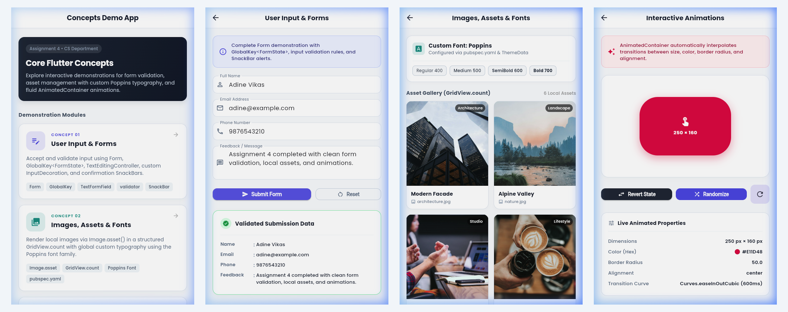

# Concepts Studio

A refined multi-screen Flutter application showcasing three foundational mobile development patterns with a clean, minimal design system and custom typography.

---

## 📌 Architecture & Modules

The application is structured around a central dashboard with named route navigation to three dedicated demonstration modules:

1. **User Input & Forms (`/form`):** Complete form lifecycle management with `GlobalKey<FormState>`, `TextFormField`, input controllers, custom field decorations, inline validators, and feedback SnackBars.
2. **Images, Assets & Fonts (`/gallery`):** Local asset configuration via `pubspec.yaml`, responsive `GridView.count` image gallery, and global custom typography powered by the **Poppins** font family.
3. **Interactive Animations (`/animation`):** Fluid, explicit property transitions using `AnimatedContainer` across dimensions, color palettes, border radiuses, and spatial alignments.

---

## 📱 Navigation Flow

```text
                     HomeScreen (/)
                           │
             ┌─────────────┼─────────────┐
             │                           │                           │
             ▼                           ▼                           ▼
      User Input & Forms         Images, Assets & Fonts         Animations
          (/form)                     (/gallery)                   (/animation)
             │                           │                           │
             ▼                           ▼                           ▼
        FormScreen                  GalleryScreen               AnimationScreen
  (Validation & SnackBar)      (GridView & Poppins Font)     (AnimatedContainer)
```

---

## 📸 Interface Showcase



### Screen Breakdown:
- **01 Concepts Studio Dashboard (`/`):** Minimalist dark hero card, clean module navigation cards, and concept feature tags.
- **02 Form & Validation Screen (`/form`):** Dynamic form validation with `GlobalKey<FormState>`, floating `SnackBar` alerts, and a validated submission preview card.
- **03 Gallery & Typography Screen (`/gallery`):** Responsive `GridView.count` rendering crisp local images, font weight showcase chips (Regular 400, Medium 500, SemiBold 600, Bold 700), and an interactive image detail modal sheet.
- **04 Interactive Animations Screen (`/animation`):** Interactive `AnimatedContainer` with live state toggling, randomized properties, and a real-time property inspector.

---

## 🧩 Technical Implementation

### 1. Navigation & Routing
- Configured using named routes in `MaterialApp.routes`:
  - `'/'` ➔ `HomeScreen`
  - `'/form'` ➔ `FormScreen`
  - `'/gallery'` ➔ `GalleryScreen`
  - `'/animation'` ➔ `AnimationScreen`
- Route transitions handled cleanly via `Navigator.pushNamed(context, route)`.
- Consistent AppBar styling with automatic back navigation across all detail screens.

### 2. Form Validation
- Managed via `GlobalKey<FormState>` and `TextEditingController`.
- **Validation Rules:**
  - **Full Name:** Minimum 3 characters, alphabetic characters only.
  - **Email Address:** RegEx validation (`r'^[\w-\.]+@([\w-]+\.)+[\w-]{2,4}$'`).
  - **Phone Number:** Exactly 10 numeric digits.
  - **Feedback / Message:** Minimum 8 characters.
- **User Feedback:** Custom floating `SnackBar` upon successful submission, along with a validated data preview container.

### 3. Asset & Typography Management
- Configured in `pubspec.yaml`:
  - `assets/images/` for local photography assets.
  - `assets/fonts/` for the Google Font **Poppins** across 4 weights.
- Applied globally via `ThemeData(fontFamily: 'Poppins', ...)`.
- Local assets rendered using `Image.asset()`.

### 4. Grid Layout
- Built with `GridView.count`:
  - `crossAxisCount: 2`
  - `crossAxisSpacing: 14`
  - `mainAxisSpacing: 14`
  - `childAspectRatio: 0.76`
- Card design includes rounded borders, category overlay tags, filenames, and tap interactions opening a detailed preview bottom sheet.

### 5. Interactive Animations
- Implemented with `AnimatedContainer` and `AnimatedAlign`:
  - Duration: `600ms`
  - Curve: `Curves.easeInOutCubic`
  - Interpolated attributes: Width, Height, Color, Border Radius, and Alignment.
- Includes **Toggle State**, **Randomize**, and **Reset** controls with a live property inspector reading out real-time values.

---

## 🚀 Getting Started

### Run Locally:
```bash
# Run in Chrome
flutter run -d chrome

# Run on macOS Desktop
flutter run -d macos
```

### Run Tests:
```bash
flutter test
```
*All tests pass with 0 warnings or errors.*

### Static Analysis:
```bash
flutter analyze
```
*0 issues found.*
